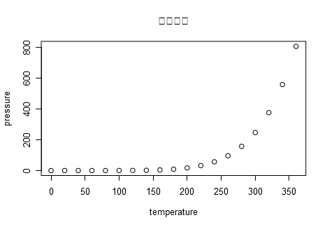
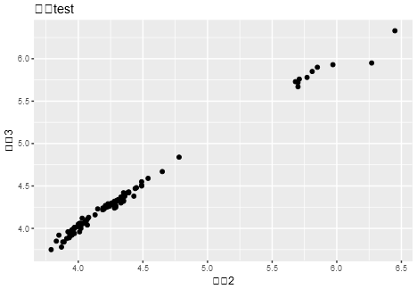

```{r setup, include=FALSE}
knitr::opts_chunk$set(
	echo = TRUE,
	message = FALSE,
	warning = FALSE
)
```

## 问题描述

利用rmarkdown和knitr创建动态报告的确是非常酷，可是在使用的过程中发现在生成pdf的时候，图表中的中文字体没办法正常显示，在网上找了很久都没有找到好的解决办法，网上大多都是说使用showtext这个包，但是按照他们的办法却并没有解决我的问题。

直到昨天又翻开很久以前已经收藏的书签[yihui/knitr/issue/799](https://github.com/yihui/knitr/issues/799)才算解决了这个问题，其实很久之前已经看过这个issue，可能当时不知道要安装showtext，所以没有才成功吧。

看问题：

```r
plot(pressure, main = "中文标题")

ggplot(head(diamonds,100),aes(x, y)) +
  geom_point() +
  ggtitle("中文test") +
  xlab("中文2") +
  ylab("中文3")
```





## 解决办法

### 方法一：使用GB1字体

当然也不是完全没有办法，还是可以通过设置family来正常显示出中文（虽然会有很多warning出现），不过没办法设置其他字体,只能使用默认的**GB1**。

```{r withGB1}
plot(pressure, main = "中文标题", family = "GB1")

ggplot(head(diamonds,100),aes(x, y)) +
  geom_point() +
  ggtitle("中文test") +
  xlab("中文2") +
  ylab("中文3") +
  theme(text = element_text(family = "GB1"))
```

这个办法只能用GB1字体，看了一些资料，貌似自己创建afm字体，或许可以使用自己想用的字体吧，但是这个方法有点难。可以看看这个[大神Paul](https://www.stat.auckland.ac.nz/~paul/R/PDF/pdfEncoding.html)的文章。

### 方法二：使用showtext

使用showtext也是很简单，只需要安装showtext，`install.packages("showtext")`，然后添加chunk的参数`fig.showtext=TRUE`就可以了。

```{r showtext, fig.showtext=TRUE}
plot(pressure, main = "中文标题")

ggplot(head(diamonds,100),aes(x, y)) +
  geom_point() +
  ggtitle("中文test") +
  xlab("中文2") +
  ylab("中文3")

```

试试自定义字体

```{r font, fig.showtext=TRUE}
library(showtext)
font.add("kaishu", "simkai.ttf")
plot(pressure, main = "中文标题", family = "kaishu")

ggplot(head(diamonds,100),aes(x, y)) +
  geom_point() +
  ggtitle("中文test") +
  xlab("中文2") +
  ylab("中文3") +
  theme(text = element_text(family = "kaishu"))
```


### 设置全局使用showtext

在setup chunk中设置如下

```
knitr::opts_chunk$set(fig.showtext=TRUE)
```

## 疑问

本页并没有任何设置字体大小的代码，但是发现最后几张图表的字体太小了。

## 参考资料

- <https://github.com/yihui/knitr/issues/799>
- <https://www.stat.auckland.ac.nz/~paul/R/PDF/pdfEncoding.html>